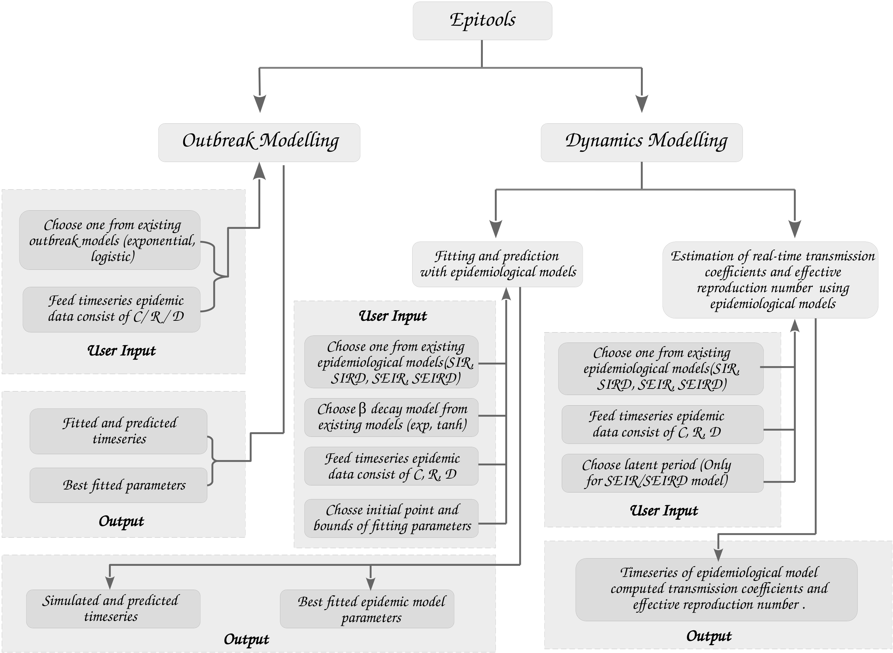
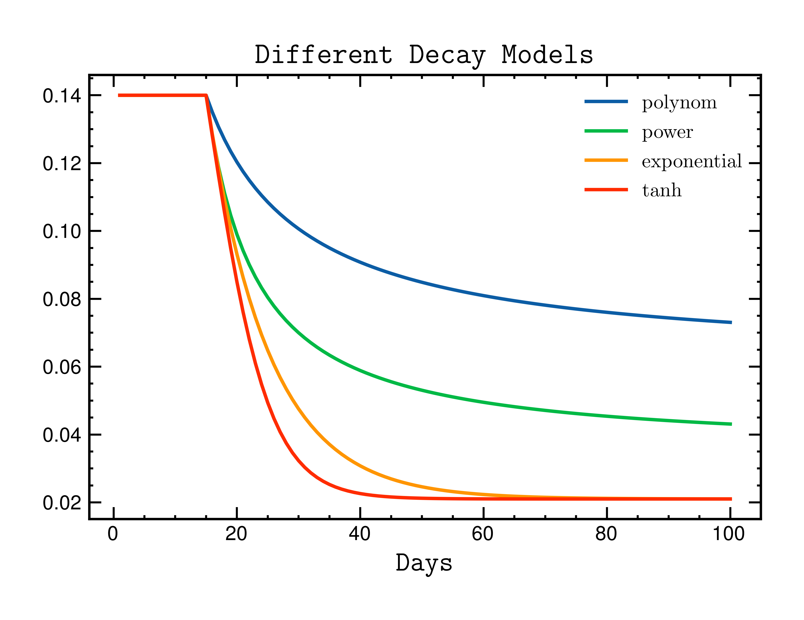

====================
Epitools description
====================

 In ``Epitools`` we implemented different outbreak models (exponential, logistic) and different epidemiological models (SIR, SIRD, SEIR, SEIRD) with time-dependent contact rate (:math:`\beta`) models (polynomial, exponential, tanh, power law) for efficient modelling and forecasting Epidemics. The following tutorial covers different functionalities of ``Epitools``. The examples of workflows reproduce the analysis will be published in `Manik et al. (2023)`_

.. _Manik et al. (2023): https://xxx.html

Flowchart of Epitools usage
---------------------------

  
Modelling and forecasting epidemic
----------------------------------
It consists of 4 main classes,  ``EpiGrowthModel, estimate_tc, EpiDynamicsModel, estimate_r``. We have discussed the usage of each class in the relevant sections below. 

Simulations
^^^^^^^^^^^
let's simulate different models of ``Epitools`` with some dummy datas first. 

So let's import ``Epitools`` other required packages first:

>>> from epitools import *
>>> import pandas  as pd
>>> import numpy as np
>>> import matplotlib.pyplot as plt

Simulation of different types of time-dependent :math:`\beta` models.

Example dataset
^^^^^^^^^^^^^^^
Suppose we have a test epidemic data in the following form :

+------------+------------+------------+----------+
|    date    |  Confirmed |  Recovered |   Death  |
+============+============+============+==========+
| 2021-02-01 |  10766245  |  10448406  |  154486  |
+------------+------------+------------+----------+
| 2021-02-02 |  10777284  |  10462631  |  154596  |
+------------+------------+------------+----------+
| 2021-02-03 |  10790183  |  10480455  |  154703  |
+------------+------------+------------+----------+
| 2021-02-04 |  10802591  |  10496308  |  154823  |
+------------+------------+------------+----------+

Here we used the COVID-19 data of India during ``01-02-2021 - 04-08-2021`` which can also be downloaded from here . Now we will try to model this real time data with different outbreak and dynamical epidemiological models from ``Epitools`` . The data can be aquired from here_.

.. _here: https://raw.githubusercontent.com/souvikmanik/covid_data/main/india.csv  
